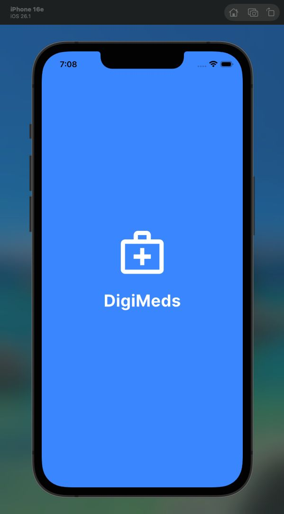
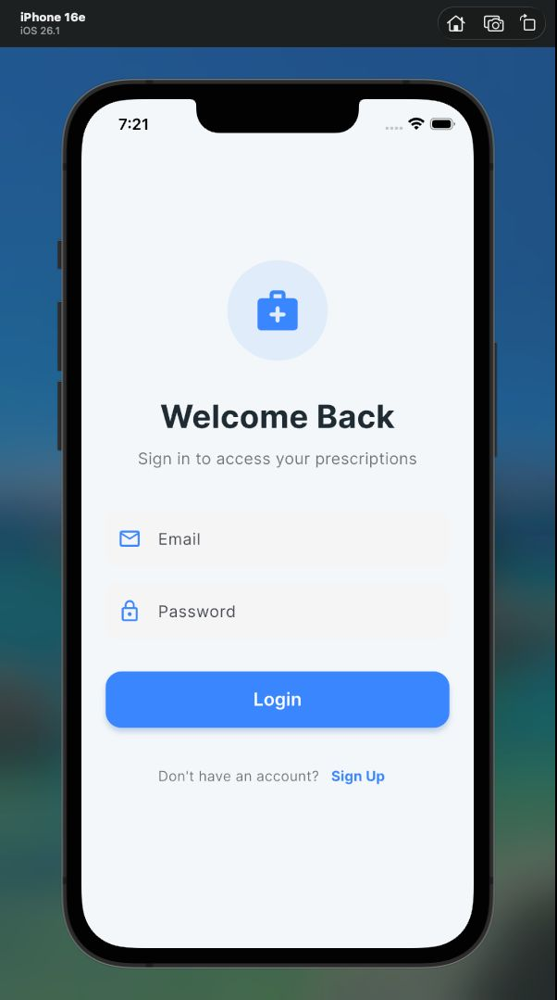
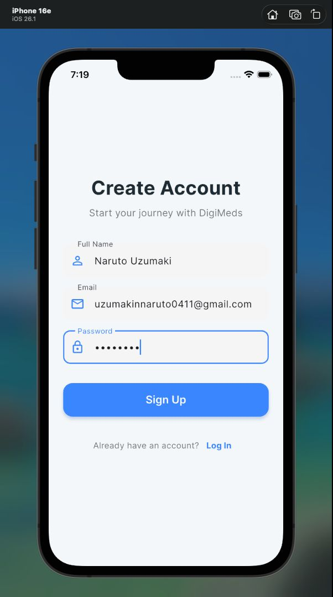
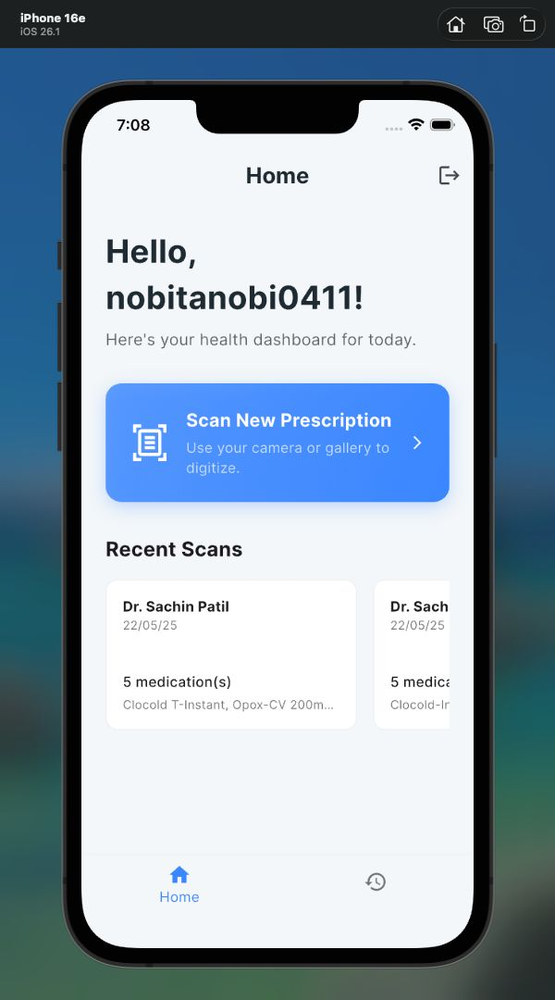
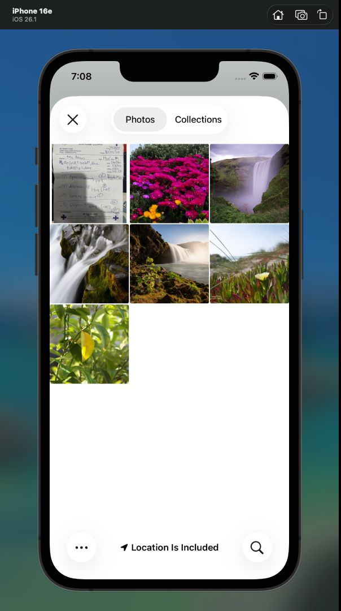
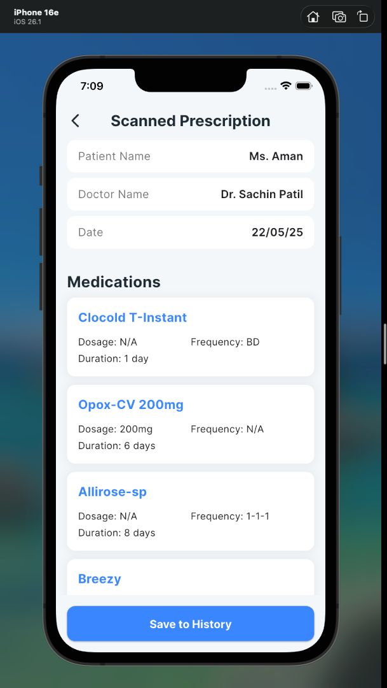
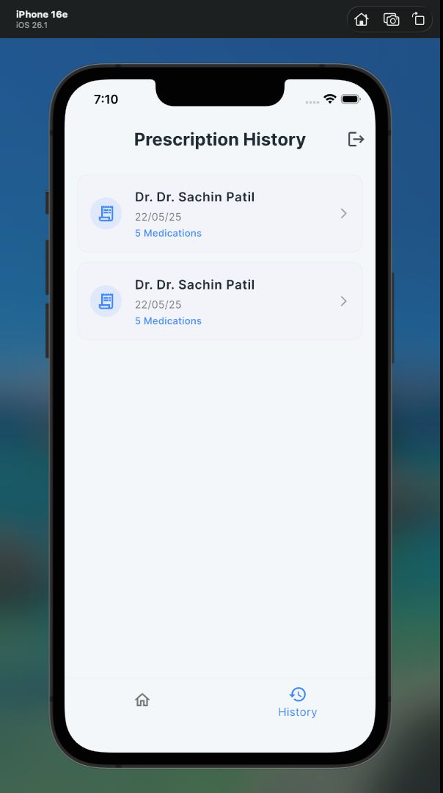

<div align="center">

  
  
  
  
  <br/>

  # 💊 DIGIMEDS
  **AN INTELLIGENT SYSTEM FOR DIGITIZING HANDWRITTEN MEDICAL PRESCRIPTIONS**

  > **Group No:** 74 | **Major Project - I** | **AY 2025-26**

</div>

---

## 📸 App Interface

<div align="center">
  <table>
    <tr>
      <td align="center"><b>Welcome Screen</b></td>
      <td align="center"><b>Secure Login</b></td>
      <td align="center"><b>New Account</b></td>
      <td align="center"><b>Smart Dashboard</b></td>
    </tr>
    <tr>
      <td></td>
      <td></td>
      <td></td>
      <td></td>
    </tr>
    <tr>
      <td align="center"><b>Image Picker</b></td>
      <td align="center"><b>AI Extraction</b></td>
      <td align="center"><b>Cloud History</b></td>
      <td align="center"></td>
    </tr>
    <tr>
      <td></td>
      <td></td>
      <td></td>
      <td></td>
    </tr>
  </table>
</div>

---
## 🎥 Video Demonstration

> [](https://drive.google.com/file/d/1YeAWUWlGvAXFVcZRTarvwFpvJbCQOEoz/view?usp=sharing)

*Click the button above to watch the 3-minute project walkthrough.*


## ✨ Key Features

| Feature | Description |
| :--- | :--- |
| **🧠 Smart Frequency Parsing** | Custom Regex engine translates medical shorthand (e.g., `1-0-1`, `BD`, `SOS`) into human-readable schedules (e.g., "Twice a day"). |
| **📷 AI-Powered OCR** | Utilizes **Gemini 1.5 Flash** to extract Doctor Name, Patient Details, and Medications from handwritten images. |
| **🔔 Auto-Reminders** | Automatically suggests and schedules local notifications based on the extracted frequency (e.g., "Thrice a Day" → 9AM, 2PM, 9PM). |
| **☁️ Cloud Sync** | Securely stores prescription history in **Firebase Firestore**, ensuring data is backed up and accessible across devices. |
| **🔐 Secure Auth** | Robust Email/Password authentication with persistent user sessions. |
| **🗑️ Data Control** | Swipe-to-delete functionality ensures users have full control over their medical history. |

---

## 🛠️ Tech Stack

- **Frontend:** Flutter (Dart) with Riverpod State Management.
- **Backend:** FastAPI (Python) for AI orchestration.
- **AI Model:** Google Gemini 1.5 Flash (Multimodal LLM).
- **Database:** Firebase Firestore (NoSQL).
- **Auth:** Firebase Authentication.
- **Local Features:** `flutter_local_notifications`, `image_picker`.

---

## 📂 Project Structure

```text
DIGIMEDS-ROOT/
├── backend/                # 🧠 Python FastAPI Server
│   ├── venv/               # Virtual Environment
│   ├── main.py             # API Endpoints & Logic
│   ├── serviceAccountKey.json # Firebase Admin Keys
│   └── requirements.txt    # Python Dependencies
│
├── digimeds/               # 📱 Flutter Mobile App
│   ├── lib/
│   │   ├── api/            # HTTP Services
│   │   ├── models/         # Data Models
│   │   ├── providers/      # Riverpod State Providers
│   │   ├── screens/        # UI Screens (Login, Home, Review, History)
│   │   ├── services/       # Notification Service
│   │   └── utils/          # Frequency Logic (Regex)
│   └── pubspec.yaml        # Flutter Dependencies
│
├── screenshots/            # App Demo Images
└── README.md               # Project Documentation


```
## 🚀 Getting Started

Follow these steps to set up the project locally.

### Prerequisites
* **Flutter SDK** installed and configured.
* **Python 3.10+** installed.
* A **Firebase Project** set up (Authentication & Firestore enabled).
* A **Google Gemini API Key**.

---

### 1. Backend Setup (FastAPI)

1.  **Navigate to the backend folder:**
    ```bash
    cd backend
    ```

2.  **Create and activate a virtual environment:**
    * **Windows:**
        ```bash
        python -m venv venv
        venv\Scripts\activate
        ```
    * **Mac/Linux:**
        ```bash
        python3 -m venv venv
        source venv/bin/activate
        ```

3.  **Install Python dependencies:**
    ```bash
    pip install -r requirements.txt
    ```

4.  **Configuration:**
    * **Step A:** Create a file named `.env` in the `backend` folder and add your Gemini Key:
        ```text
        GOOGLE_API_KEY=your_actual_api_key_here
        ```
    * **Step B:** Download your `serviceAccountKey.json` from the Firebase Console (*Project Settings > Service Accounts*) and place it inside the `backend` folder.

5.  **Run the server:**
    * Use `0.0.0.0` to allow access from mobile devices on the same network.
    ```bash
    uvicorn main:app --host 0.0.0.0 --port 8000
    ```

---

### 2. Frontend Setup (Flutter)

1.  **Navigate to the app folder:**
    ```bash
    cd digimeds
    ```

2.  **Install Flutter packages:**
    ```bash
    flutter pub get
    ```

3.  **Configure API Endpoint:**
    * Find your computer's local IP address (e.g., run `ipconfig` on Windows or `ifconfig` on Mac).
    * Open `lib/api/api_service.dart`.
    * Update the `baseUrl` variable:
        ```dart
        // Replace with your actual IP address
        static const String baseUrl = "[http://192.168.1.](http://192.168.1.)X:8000"; 
        ```

4.  **Run the App:**
    * Connect your physical device via USB or start an emulator.
    ```bash
    flutter run
    ```
